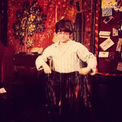

<p align="center">
  
</p>

<h1 align="center">
   Harry Potter - Invisibility Cloak
</h1>

<p align="center">
  <a href="https://github.com/iam-salma/opencv-invisibility-cloak/stargazers">
    
  </a>
  <a href="https://github.com/iam-salma/opencv-invisibility-cloak/fork">
    
  </a>
  <a href="https://github.com/iam-salma/opencv-invisibility-cloak/issues">
    
  </a>
  <a href="https://github.com/iam-salma/opencv-invisibility-cloak/pulls">
    
  </a>
  
</p>

A real-time computer vision application that creates the illusion of invisibility using a solid blue-colored cloak and background subtraction techniques. Built with OpenCV and PyQt5 for an interactive GUI.

---

## ✨ Features

- 📷 Live Webcam Feed
  → Real-time video stream using OpenCV in PyQt5 GUI.

- 🧥 Invisible Cloak Effect
  → Detects and hides the blue cloak.

- 🧼 Noise Reduction
  → Morphological operations for cleaner mask (open, dilate, erode).

- 🖼️ Background Capture
  → Captures noise-free static background (averaged over 60 frames).

- 🔁 Automatic Frame Flipping
  → Flips frame horizontally to match mirror view.

- 💬 Voice Feedback
  → Guides user using text-to-speech during background capture.

- 📊 Brightness Detection
  → Skips background capture if lighting is too low.

- 🎨 GUI with PyQt5
  → Clean interface with dark theme and real-time preview.

---

### 📂 Folder Structure

```bash
.
├── main.py                  # Entry point – launches the GUI
│
├── cloak/                   # Core cloak effect logic
│   ├── cloak.py             # Cloak blending logic
│   ├── capture.py           # Webcam capture and mask generation
│   └── utils.py             # Helper functions (e.g., brightness checks)
│
├── ui/                      # User interface components
│   └── window.py            # Main application window using PyQt
│
├── styles/                 # Custom themes or stylesheets
│   └── dark_theme.py        # Dark theme stylesheet
│
├── assets/                 # Static resources
│   └── harry-potter-invisible.gif  # Demo GIF, icons, images
│
└── README.md               # Project documentation
```

---

### 🚀 Getting Started

#### 1. Clone the repo
```bash
    git clone https://github.com/yourusername/opencv-invisibility-cloak.git
    cd opencv-invisibility-cloak
```
#### 2. Install dependencies
```bash
    pip install -r requirements.txt
```

#### 3. Run the app
```bash
    python main.py
```

---

### Tips for Best Results
- Use a solid-colored blue cloak.
- Ensure even lighting — avoid shadows or reflections.
- Capture the background without the person.

---

If you found this project helpful or interesting, please consider giving it a ⭐️ on GitHub — it motivates and helps others discover it! ✌️

ENJOY! 🎉